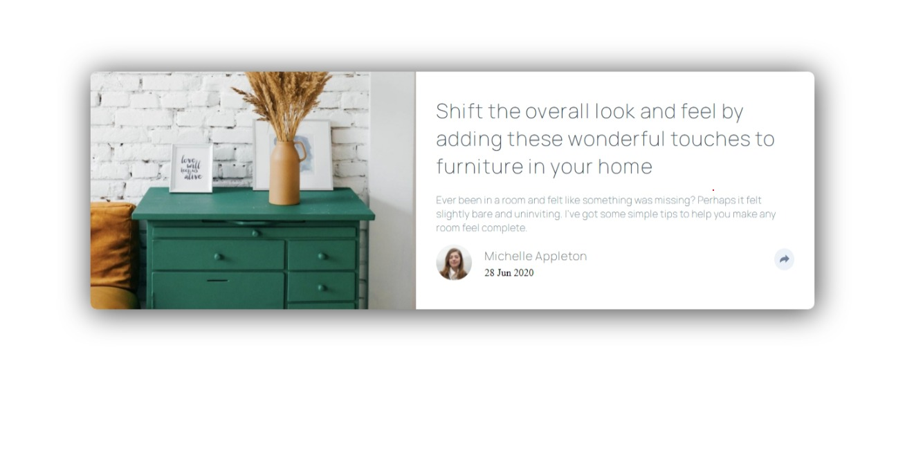

# Frontend Mentor - Article preview component solution
## you can view page live at following URL: https://gigagiorgadze.github.io/Article-preview-component/


# Frontend Mentor - Article preview component

This is a solution to the [Article preview component challenge on Frontend Mentor](https://www.frontendmentor.io/challenges/article-preview-component-dYBN_pYFT). Frontend Mentor challenges help you improve your coding skills by building realistic projects. 

## Table of contents

- [Overview](#overview)
  - [The challenge](#the-challenge)
  - [Screenshot](#screenshot)
  - [Links](#links)
- [My process](#my-process)
  - [Built with](#built-with)
  - [What I learned](#what-i-learned)
  - [Useful resources](#useful-resources)
- [Author](#author)


## Overview

### The challenge

Users should be able to:

- View the optimal layout for the component depending on their device's screen size
- See the social media share links when they click the share icon

### Screenshot



### Links

- Solution URL: [solution URL](https://www.frontendmentor.io/solutions/htmlcssjsdom-KTUEVM6Tg)
- Live Site URL: [live site URL](https://gigagiorgadze.github.io/Article-preview-component/)

## My process

### Built with

- Semantic HTML5 markup
- CSS custom properties
- Flexbox
- JavaScript DOM manipulation
- css :after pseudo selector

### What I learned

i learned how to add triangle below div to make share pop up, on wide screens i did it using following HTML and CSS codes

``` html 
  <div class="hero"><p>SHARE</p>
      
      
      
      </div>
```
``` css 
  .hero {
    position:relative;
    background-color:  hsl(217, 19%, 35%);
    height:20% ;
    width:40% ;
    box-sizing: border-box;
    padding: 1% 1% 1% 5%;
    left: 77%;
    bottom: 45%;
    opacity: 0;
    transition: 1s;
}
.hero > *{
    margin-left:5%;
}
.hero p{
    display: inline-block;
    color: hsl(210, 46%, 95%);
}
.hero:after {
    content:'';
    position: absolute;
    top: 100%;
    left: 0;
    right: 0;
    margin: 0 auto;
    width: 0;
    height: 0;
    border-top: solid 20px  hsl(217, 19%, 35%);
    border-left: solid 20px transparent;
    border-right: solid 20px transparent;
}
```

i also learned how to make page not animate transtions on page load with this code
 ``` html 
    <body class="preload">...</body>
 ```
``` css 
  .preload * {
    -webkit-transition: none !important;
    -moz-transition: none !important;
    -ms-transition: none !important;
    -o-transition: none !important;
  }
```
```js 
document.body.classList.remove('preload')
```

### Useful resources

- [transition not triggering on page load](https://css-tricks.com/transitions-only-after-page-load/) - this helped me in not making transition trigger on page load which i will use in future projects


## Author

- Frontend Mentor - [@GigaGiorgadze](https://www.frontendmentor.io/solutions/htmlcssjsdom-KTUEVM6Tg)
- Twitter - [@giorgadze_11](https://twitter.com/giorgadze_11)


